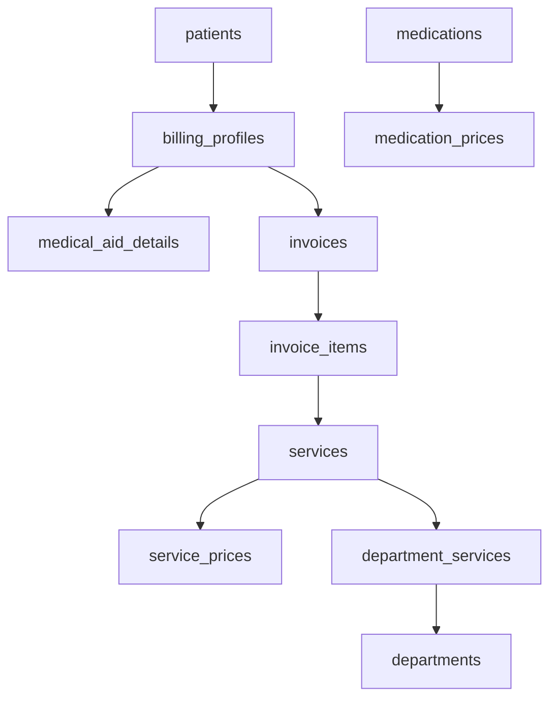

# 🏥 MediFlow Billing Module

A comprehensive billing system for healthcare facilities with support for both cash and medical aid payments, real-time service capture, and flexible invoice management.

## 📋 Table of Contents

- [Overview](#overview)
- [Features](#features)
- [Database Schema](#database-schema)
- [Installation](#installation)
- [Usage](#usage)
- [API Functions](#api-functions)
- [Integration](#integration)
- [Configuration](#configuration)
- [Troubleshooting](#troubleshooting)

## 🎯 Overview

The MediFlow Billing Module provides a complete billing solution that integrates seamlessly with your existing patient management system. It supports:

- **Dual Billing Types**: Cash and Medical Aid payments
- **Real-time Service Capture**: From doctors, nurses, and front desk
- **Flexible Pricing**: Department-specific and cross-department services
- **Comprehensive Invoicing**: Multiple invoices per visit, interim billing for inpatients
- **Audit Trail**: Complete history of pricing changes and billing activities

## ✨ Features

### 🏥 Service Management
- **Department-specific services** with automatic filtering
- **Cross-department services** available in all relevant departments
- **Service categories**: Consultations, Diagnostics, Treatments, Administrative
- **Active/inactive service management**

### 💰 Pricing System
- **Dual pricing**: Cash (lower) and Medical Aid (higher) rates
- **Effective date tracking** for price changes
- **Price history** for audit purposes
- **Automatic price calculation** based on billing type

### 📊 Billing Workflow
- **Outpatient**: Multiple invoices per visit, finalized at consultation end
- **Inpatient**: Interim invoices during stay, final billing at discharge
- **Real-time capture**: Quick dropdown + add button interface
- **Multiple access points**: Doctor, Nurse, Front Desk interfaces

### 🆔 Patient Billing Profiles
- **Billing type selection**: Cash or Medical Aid
- **Medical aid details**: Provider, membership, plan type
- **Authorization tracking**: Required vs. optional authorizations
- **Profile management**: Create, update, and maintain billing information

### 🧾 Invoice Management
- **Auto-generated numbers**: INV-2024-001, INV-2024-002 format
- **Status tracking**: Open → Interim → Closed → Finalized
- **Itemized billing**: Service-by-service breakdown
- **Total calculation**: Automatic sum of all items

## 🗄️ Database Schema

### Core Tables

| Table | Purpose | Key Fields |
|-------|---------|------------|
| `billing_profiles` | Patient billing preferences | `patient_id`, `billing_type` |
| `medical_aid_details` | Medical aid information | `provider_name`, `membership_number` |
| `services` | Available medical services | `name`, `description`, `is_cross_department` |
| `department_services` | Service-department mapping | `service_id`, `department_id` |
| `service_prices` | Service pricing | `service_id`, `billing_type`, `price` |
| `invoices` | Patient invoices | `invoice_number`, `status`, `total_amount` |
| `invoice_items` | Invoice line items | `service_id`, `quantity`, `unit_price` |
| `medications` | Available medications | `name`, `description`, `unit` |
| `medication_prices` | Medication pricing | `medication_id`, `billing_type`, `price` |

### Key Relationships



## 🚀 Installation

### Step 1: Create Database Schema

Run the main schema creation script:

```sql
-- Execute this first
\i billing_module_schema.sql
```

### Step 2: Create Helper Functions

Run the functions creation script:

```sql
-- Execute this second
\i billing_functions.sql
```

### Step 3: Load Sample Data

Run the sample data script:

```sql
-- Execute this third
\i billing_sample_data.sql
```

### Step 4: Verify Installation

Check that all tables and functions were created:

```sql
-- Verify tables
SELECT table_name FROM information_schema.tables 
WHERE table_schema = 'public' 
AND table_name LIKE '%billing%' OR table_name LIKE '%service%' OR table_name LIKE '%invoice%';

-- Verify functions
SELECT routine_name FROM information_schema.routines 
WHERE routine_schema = 'public' 
AND routine_name LIKE '%billing%' OR routine_name LIKE '%invoice%';
```

## 💻 Usage

### Creating a Billing Profile

```sql
-- For cash payment
SELECT create_or_get_billing_profile(
    'patient-uuid-here', 
    'cash'
);

-- For medical aid
SELECT create_or_get_billing_profile(
    'patient-uuid-here', 
    'medical_aid',
    'Discovery Health',
    '123456789',
    'Classic Comprehensive'
);
```

### Adding Services to Invoice

```sql
-- Add a service to an existing invoice
SELECT add_service_to_invoice(
    'invoice-uuid-here',
    'service-uuid-here',
    1, -- quantity
    'user-uuid-here' -- who added it
);
```

### Managing Invoices

```sql
-- Get patient invoices
SELECT * FROM get_patient_invoices('patient-uuid-here');

-- Get invoice details
SELECT * FROM get_invoice_details('invoice-uuid-here');

-- Close invoice
SELECT close_invoice('invoice-uuid-here');

-- Finalize invoice
SELECT finalize_invoice('invoice-uuid-here');
```

## 🔌 API Functions

### Core Billing Functions

| Function | Purpose | Parameters | Returns |
|----------|---------|------------|---------|
| `generate_invoice_number()` | Generate unique invoice number | None | VARCHAR |
| `calculate_invoice_total(uuid)` | Calculate invoice total | `invoice_id` | DECIMAL |
| `add_service_to_invoice(uuid, uuid, int, uuid)` | Add service to invoice | `invoice_id`, `service_id`, `quantity`, `user_id` | UUID |
| `create_or_get_billing_profile(uuid, varchar, varchar, varchar, varchar)` | Create/update billing profile | `patient_id`, `billing_type`, `provider`, `membership`, `plan` | UUID |

### Query Functions

| Function | Purpose | Parameters | Returns |
|----------|---------|------------|---------|
| `get_patient_billing_profile(uuid)` | Get patient billing info | `patient_id` | TABLE |
| `get_department_services(uuid)` | Get services for department | `department_id` | TABLE |
| `get_patient_invoices(uuid)` | Get patient invoice history | `patient_id` | TABLE |
| `get_invoice_details(uuid)` | Get invoice line items | `invoice_id` | TABLE |

### Management Functions

| Function | Purpose | Parameters | Returns |
|----------|---------|------------|---------|
| `close_invoice(uuid)` | Close an open invoice | `invoice_id` | BOOLEAN |
| `finalize_invoice(uuid)` | Finalize a closed invoice | `invoice_id` | BOOLEAN |

## 🔗 Integration

### Frontend Integration

The billing module integrates with existing MediFlow components:

#### Doctor's Consultation Panel
```typescript
// Add billing service during consultation
const addBillingService = async (serviceId: string, quantity: number = 1) => {
  const { data, error } = await supabase.rpc('add_service_to_invoice', {
    p_invoice_id: currentInvoiceId,
    p_service_id: serviceId,
    p_quantity: quantity,
    p_added_by: currentUserId
  });
};
```

#### Nurse's Vitals Interface
```typescript
// Add vitals check to billing
const addVitalsBilling = async () => {
  const vitalsServiceId = await getServiceIdByName('Vitals Check');
  await addBillingService(vitalsServiceId);
};
```

#### Front Desk Dashboard
```typescript
// Add administrative fees
const addAdminFee = async () => {
  const adminServiceId = await getServiceIdByName('Administration Fee');
  await addBillingService(adminServiceId);
};
```

### Real-time Updates

The system supports real-time billing updates:

```typescript
// Subscribe to invoice changes
const subscription = supabase
  .channel('invoice_updates')
  .on('postgres_changes', {
    event: '*',
    schema: 'public',
    table: 'invoices'
  }, (payload) => {
    // Update UI with new invoice data
    updateInvoiceDisplay(payload);
  })
  .subscribe();
```

## ⚙️ Configuration

### Service Configuration

#### Adding New Services
```sql
-- Add a new service
INSERT INTO public.services (name, description, is_cross_department) VALUES
('New Service', 'Description of new service', false);

-- Add pricing for the service
INSERT INTO public.service_prices (service_id, billing_type, price) VALUES
((SELECT id FROM public.services WHERE name = 'New Service'), 'cash', 150.00),
((SELECT id FROM public.services WHERE name = 'New Service'), 'medical_aid', 225.00);

-- Link to departments
INSERT INTO public.department_services (service_id, department_id) VALUES
((SELECT id FROM public.services WHERE name = 'New Service'), 'department-uuid-here');
```

#### Updating Service Prices
```sql
-- Deactivate old price
UPDATE public.service_prices 
SET is_active = false 
WHERE service_id = 'service-uuid-here' 
AND billing_type = 'cash';

-- Add new price
INSERT INTO public.service_prices (service_id, billing_type, price, effective_date) VALUES
('service-uuid-here', 'cash', 175.00, CURRENT_DATE);
```

### Department Configuration

#### Enable/Disable Billing
```sql
-- Disable billing for a department
UPDATE public.departments 
SET billing_enabled = false 
WHERE id = 'department-uuid-here';

-- Enable billing for a department
UPDATE public.departments 
SET billing_enabled = true 
WHERE id = 'department-uuid-here';
```

#### Department-Specific Services
```sql
-- Remove service from department
UPDATE public.department_services 
SET is_active = false 
WHERE service_id = 'service-uuid-here' 
AND department_id = 'department-uuid-here';

-- Add service to department
INSERT INTO public.department_services (service_id, department_id) VALUES
('service-uuid-here', 'department-uuid-here');
```

## 🐛 Troubleshooting

### Common Issues

#### 1. "No active price found" Error
**Problem**: Service has no active pricing for the billing type
**Solution**: 
```sql
-- Check if service has pricing
SELECT * FROM public.service_prices 
WHERE service_id = 'service-uuid-here' 
AND billing_type = 'cash' 
AND is_active = true;

-- Add pricing if missing
INSERT INTO public.service_prices (service_id, billing_type, price) VALUES
('service-uuid-here', 'cash', 100.00);
```

#### 2. "Service not available in department" Error
**Problem**: Service not linked to the department
**Solution**:
```sql
-- Check department services
SELECT * FROM public.department_services 
WHERE department_id = 'department-uuid-here' 
AND service_id = 'service-uuid-here';

-- Link service to department
INSERT INTO public.department_services (service_id, department_id) VALUES
('service-uuid-here', 'department-uuid-here');
```

#### 3. Invoice Number Generation Issues
**Problem**: Invoice numbers not generating correctly
**Solution**:
```sql
-- Test invoice number generation
SELECT generate_invoice_number();

-- Check existing invoice numbers
SELECT invoice_number FROM public.invoices 
ORDER BY created_at DESC 
LIMIT 5;
```

### Performance Optimization

#### Index Usage
The system includes optimized indexes for common queries:

```sql
-- Check index usage
SELECT schemaname, tablename, indexname, idx_scan, idx_tup_read, idx_tup_fetch
FROM pg_stat_user_indexes
WHERE tablename LIKE '%billing%' OR tablename LIKE '%service%' OR tablename LIKE '%invoice%'
ORDER BY idx_scan DESC;
```

#### Query Optimization
For large datasets, consider partitioning:

```sql
-- Example: Partition invoices by year
CREATE TABLE invoices_2024 PARTITION OF invoices
FOR VALUES FROM ('2024-01-01') TO ('2025-01-01');
```

## 📚 Next Steps

### Immediate Actions
1. **Run the installation scripts** in order
2. **Configure department services** for your facility
3. **Set custom pricing** based on your fee structure
4. **Test billing workflows** with sample patients

### Future Enhancements
1. **Pharmacy Module**: Medication dispensing and billing
2. **Payment Processing**: Credit card, EFT integration
3. **Insurance Claims**: Automated medical aid submissions
4. **Reporting Dashboard**: Financial analytics and insights
5. **Mobile App**: Patient billing portal

### Support
For technical support or questions about the billing module:

- **Documentation**: Refer to this README and inline code comments
- **Database Logs**: Check PostgreSQL logs for detailed error messages
- **Testing**: Use the verification queries in the sample data script

---

## 🎉 Success!

Your MediFlow Billing Module is now ready to use! The system provides a robust foundation for managing all aspects of healthcare billing while maintaining flexibility for future enhancements.

**Happy Billing! 💰🏥**
